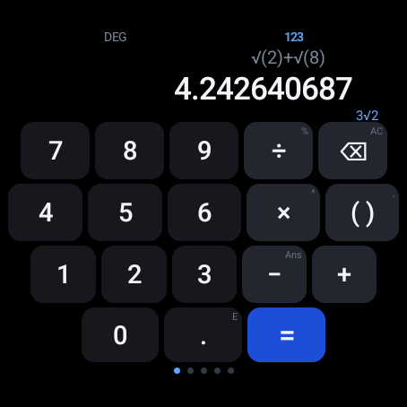
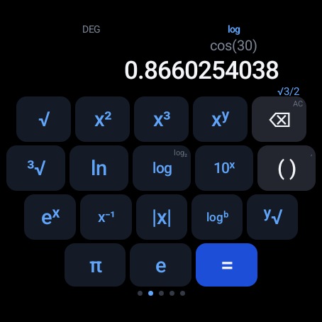
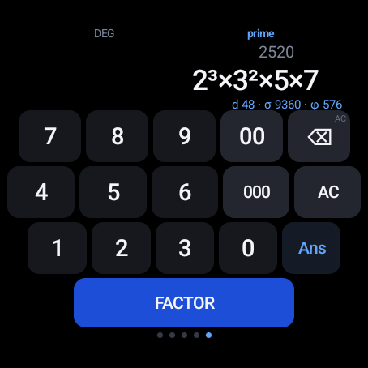

<div align="center">


# WatchCalc

**A scientific calculator for Wear OS, shaped for round watch screens.**

[](https://play.google.com/store/apps/details?id=com.bunnypranav.watchcalc)





</div>

---

Most watch calculators are phone calculators shrunk down until they stop being
usable. This one is laid out for a circle: each row of keys is only as wide as
the screen actually is at that height, so all eighteen keys on a page stay
reachable and none of them disappear under the bezel.

Five keypads, one swipe apart. It runs entirely on the watch, no phone app, no
account, and no internet permission at all.

## What it does

- **Numbers**: the four operators and one bracket key that works out whether to
  open or close
- **Roots and logs**: √ ∛ x² x³ xʸ, ln, log, log₂, 10ˣ, eˣ, x⁻¹, |x|, log to
  any base, any root
- **Trigonometry**: sin cos tan, sec cosec cot, all six inverses, hyperbolics,
  degrees ↔ radians
- **More**: nCr, nPr, factorial, percent, mod, gcd, lcm, memory, history
- **Prime factors**: Along with the divisor count, divisor sum and Euler's totient
- **30 physics and chemistry constants** you can drop straight into the calculation

A few things that make it nicer to actually use:

**Exact answers under the decimal.** `cos(30)` gives `0.8660254038` and `√3/2`
underneath. `π/4` stays `π/4`. `0.375` shows as `3/8`.

**It reads sums the way you write them.** Precedence follows a Casio fx-991
rather than a programming language, so `1/2π` means `1/(2π)`. `sin 180` is `0`,
not `1.22×10⁻¹⁶`.

**You don't need to type the closing bracket.** `sin(30` then `=` evaluates `sin(30)`.

**Long-press any key** for the small grey label in its corner, every trig key
has its inverse there.

## Widgets

Swiping left from the watch face gets you shortcuts that open the calculator
*directly* on a keypad, rather than wherever you left it. There are five to
choose from, so you can pick whichever suits your watch face:

| | |
| --- | --- |
| **WatchCalc shortcuts** | all three buttons in one half-height widget |
| **WatchCalc 123 / log / trig** | one keypad each, added individually |
| **WatchCalc** | all three buttons, full screen |

On a Galaxy Watch the half-height ones stack two to a screen, so the calculator
can share space with something else instead of taking a whole screen.

## Installing

Go to <https://play.google.com/store/apps/details?id=com.bunnypranav.watchcalc> and click install

You may also choose to grab the APK from the [Releases](../../releases) page and sideload it. Enable
ADB debugging on the watch (*Settings → Developer options*), then:

```bash
adb pair <watch-ip>:<pairing-port> <pairing-code>
adb connect <watch-ip>:<connection-port>
adb install -r watchcalc.apk
```

## Privacy

WatchCalc has **no internet permission**, so it cannot send anything anywhere
even in principle. No account, no analytics, no ads, no tracking.

Your angle mode, memory, last answer and recent history are saved on the watch
so it picks up where you left off, and they're deleted when you uninstall.
Backup is switched off, so the system won't sync them off-device either.

## Building

You'll need Android Studio, or just a JDK:

```bash
./gradlew :app:assembleRelease     # APK
./gradlew test                     # the test suite
```

The release build falls back to a debug signing key, which is fine for putting
it on your own watch.

## Contributing

Issues and pull requests are welcome. A few things worth knowing before you dig
in:

- **Keys are data, not code.** Adding one means adding an entry to `PAGES` in
  [`ui/Keys.kt`](app/src/main/kotlin/com/bunnypranav/watchcalc/ui/Keys.kt). Keep
  rows at 5/5/5/3 or the round-screen layout stops fitting.
- **Run the tests.** The maths engine is pinned to a set of reference values, so
  `./gradlew test` will tell you quickly if something drifted.
- [`docs/implementation.md`](docs/implementation.md) explains how the round
  layout, the calculator engine and the widgets work, if you want the details.

## Related

There's also a [web version](https://calc.bunnyorg.in) of the same calculator
that runs in the watch browser, same design, same behaviour.

## AI Usage

AI was used to assist in the porting of this project from web to android. All code written by an LLM was monitored and reviewed with passing tests.

## License

[GPL-3.0](LICENSE)
